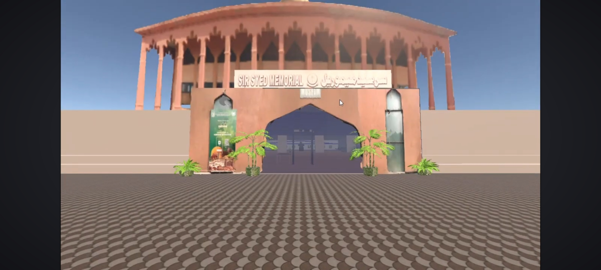
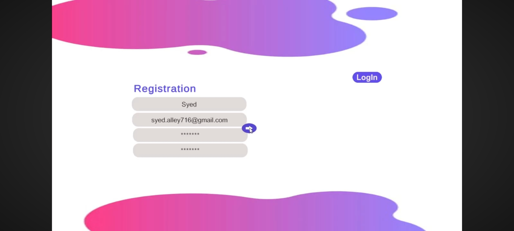
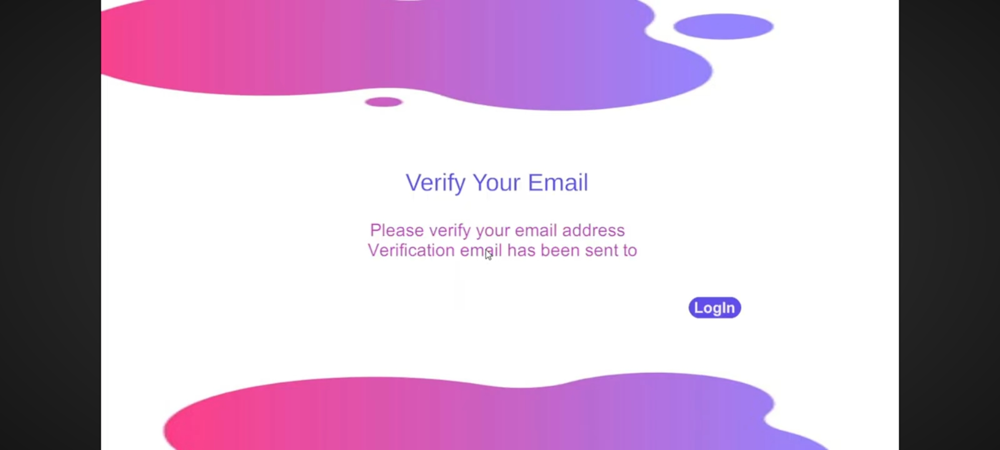
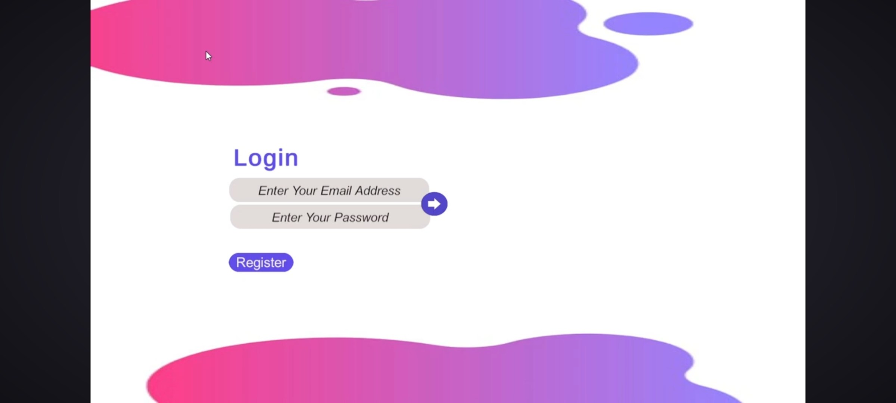
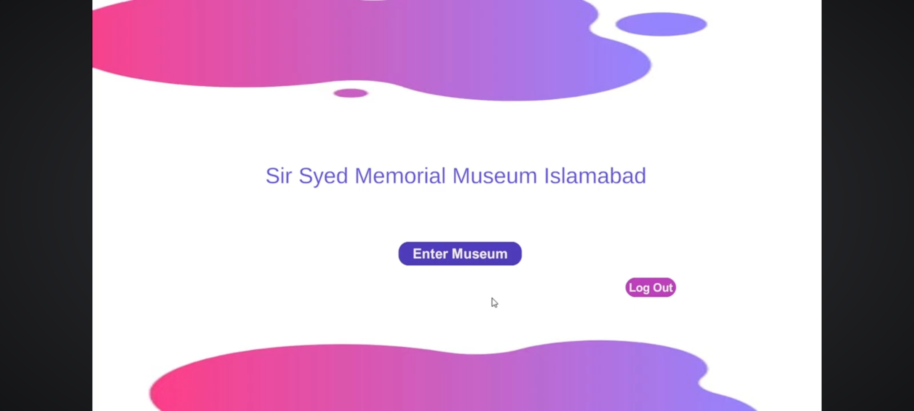
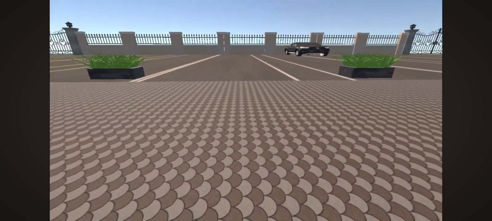

# 🏛️ Virtual Museum Tour — Sir Syed Memorial Museum Islamabad

A fully immersive virtual museum experience built in Unity, allowing users to explore the Sir Syed Memorial Museum Islamabad in a realistic 3D environment.

---

## 🎥 Walkthrough Video

---

## 📸 Screenshots

---

## ✨ Features
- 🔐 **Firebase Authentication** — Secure login with email verification
- 🏛️ **Real Museum Layout** — 3 halls + parking area fully explorable
- 📡 **LiDAR 3D Scanning** — Real artifacts scanned and recreated in 3D
- 🚶 **Realistic Player Movement** — Walk through the museum naturally
- 🗺️ **Smart Scene Management** — Auto returns to welcome page at main gate
- 👋 **Welcome Page** — Smooth transition between login and museum

---

## 🛠️ Tech Stack

| Layer | Technology |
|-------|-----------|
| Game Engine | Unity |
| Programming | C# |
| Authentication | Firebase |
| 3D Modeling | LiDAR Scanning |
| Scene Management | Unity Scene Manager |

---

## 🏗️ Project Structure

| Folder | Description |
|--------|-------------|
| Assets/Scenes | All Unity scenes (Login, Welcome, Museum, Parking) |
| Assets/Scripts | C# scripts (Auth, Player, Scene Manager) |
| Assets/Models | LiDAR scanned 3D models of artifacts |
| Assets/Prefabs | Reusable Unity prefabs |

---

## 🎮 How It Works
1. User **signs up / logs in** via Firebase Authentication
2. **Email verification** is sent and confirmed
3. User lands on **Welcome Page**
4. Enters museum and explores **3 halls & parking**
5. When player reaches **main gate** — auto returns to Welcome Page

---

## 📡 LiDAR Scanning
Real artifacts from Sir Syed Memorial Museum Islamabad were scanned using a **LiDAR sensor** to create accurate 3D models, giving users an authentic virtual experience of the actual museum.

---

## 🚀 Getting Started

### Option 1: Download & Run (Recommended)
1. Go to the repository
2. Download **VirtualMuseumTour.exe** (or whatever your file is named)
3. Run the .exe file
4. Login or create an account
5. Explore the museum!

---

## 🎓 Academic Details
- **University:** COMSATS University Islamabad — Abbottabad Campus
- **Degree:** BS Computer Science
- **Completion:** August 2024
- **Type:** Final Year Project (FYP)

---

## 📬 Contact

**Muhammad Ali Shah**

- 🐙 GitHub: [@syedali067](https://github.com/syedali067)
- 💼 LinkedIn: [muhammad-ali-mern067](https://www.linkedin.com/in/muhammad-ali-mern067)
- 📧 Email: as7073085@gmail.com

---

## 📄 License
This project is open source and available under the MIT License.
